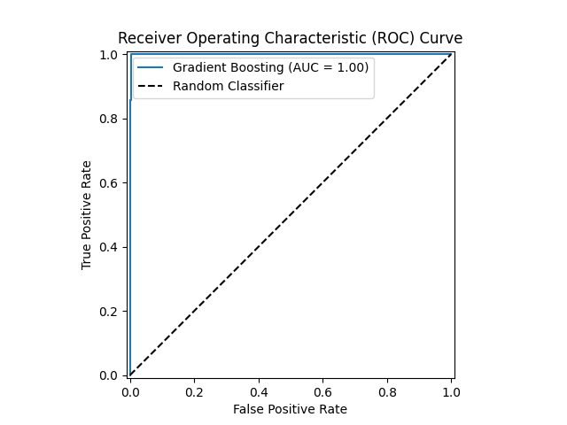
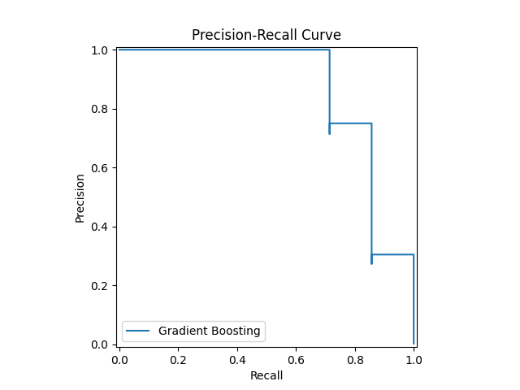

# Predicting Credit Card Fraud

## Overview

This project builds a highly accurate machine learning model to predict fraudulent credit card transactions. The primary challenge in this task is the highly imbalanced nature of the data, where fraudulent transactions are extremely rare compared to legitimate ones. We address this using advanced techniques and a robust model to ensure reliable predictions.

## Features

- Handling Imbalanced Data: Employs SMOTE (Synthetic Minority Over-sampling Technique) to balance the dataset and improve the model's ability to detect the rare fraud class.

- Gradient Boosting Model: Utilizes a Gradient Boosting Classifier, an ensemble model known for its high performance on structured data.

- Hyperparameter Tuning: Uses Grid Search with cross-validation to automatically find the optimal model parameters.

- Comprehensive Evaluation: Evaluates the model using metrics crucial for imbalanced classification, including Precision, Recall, F1-Score, and AUC.

- Informative Visualizations: Generates ROC and Precision-Recall curves to visualize the model's performance and trade-offs.

## Technologies Used

- Python: The core programming language.

- Scikit-learn: The primary machine learning library for model building and evaluation.

- Imbalanced-learn: A crucial library for handling imbalanced datasets with techniques like SMOTE.

- Pandas & NumPy: Used for data loading, manipulation, and numerical operations.

- Matplotlib & Seaborn: Powerful libraries for creating all visualizations.

## Data Analysis & Processing

The project uses a credit card transaction dataset where transactions are labeled as either fraudulent or legitimate. The data is highly imbalanced, with fraud representing less than 0.2% of the total transactions. The data is split into training and testing sets, and the SMOTE technique is applied only to the training set to prevent data leakage.

## Model Used

The central model is the GradientBoostingClassifier. This algorithm works by sequentially training a series of "weak learners" (simple decision trees). Each new tree is designed to correct the errors made by the previous trees, gradually building a strong, accurate predictive model.

## Model Training

Model training is performed using a Pipeline to ensure a consistent workflow, applying SMOTE before the classifier. The pipeline is then passed to GridSearchCV to automatically tune key hyperparameters (n_estimators, learning_rate, max_depth). This process finds the best combination of parameters to maximize the F1-Score, a metric that balances the trade-off between precision and recall.

## How to Run the Project

1. Clone the repository:

```bash
git clone <https://github.com/sjain2580/Predicting-Credit-Card-Fraud>
cd <repository_name>
```

2. Create and activate a virtual environment (optional but recommended):python -m venv venv

- On Windows:
  
```bash
.\venv\Scripts\activate
```

- On macOS/Linux:

```bash
source venv/bin/activate
```

3. Install the required libraries:

```bash
pip install -r requirements.txt
```

4. Run the Script:

```bash
python fraud_detection.py
```

## Visualization

The script will print the evaluation metrics and generate two key plots:

- Receiver Operating Characteristic (ROC) Curve: This plot illustrates the model's ability to distinguish between the two classes. A curve closer to the top-left corner indicates better performance.


- Precision-Recall Curve: This plot is particularly informative for imbalanced datasets, as it shows the trade-off between precision and recall for different classification thresholds. A curve that stays high on the y-axis (high precision) as recall increases is desirable.


## Contributors

**<https://github.com/sjain2580>**
Feel free to fork this repository, submit issues, or pull requests to improve the project. Suggestions for model enhancement or additional visualizations are welcome!

## Connect with Me

Feel free to reach out if you have any questions or just want to connect!
**[](https://www.linkedin.com/in/sjain04/)**
**[](https://github.com/sjain2580)**
**[](mailto:sjain040395@gmail.com)**

---
